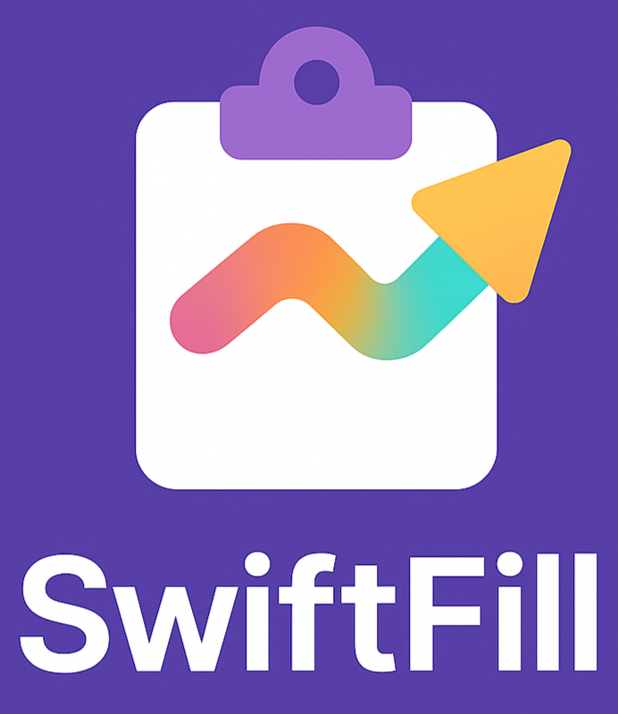

# 🚀 SwiftFill - Google Form Autofiller Chrome Extension

SwiftFill is a lightweight Chrome extension that **automatically fills out Google Forms** with your saved personal information. No more typing the same details over and over again — save once and autofill forever!

---

## ✨ Features

- 🔐 Save your info securely using Chrome's local storage
- ⚡ One-click form autofill on supported Google Forms
- 🎯 Supports input fields, radio buttons, dropdowns & checkboxes
- 🧠 Smart mapping based on form questions
- 🧩 Lightweight and fast with a minimal UI
- 📄 Works offline and never sends your data to any server

---

## 📦 How to Use

1. **Install Extension** (manually for now):
   - Clone or download this repository
   - Go to `chrome://extensions/`
   - Enable **Developer mode**
   - Click **Load unpacked** and select the `form_autofiller` folder

2. **Set Your Info**:
   - Click on the extension icon
   - Click "⚙️ Set My Info"
   - Fill out your details and hit **💾 Save Info**

3. **Use It**:
   - Open any Google Form
   - Click the extension icon
   - Hit **Fill Form** — and you're done! ✅

---

## 📸 Screenshots

| Setup Page | Google Form Autofill |
|------------|----------------------|
|  |  |

---

## 🚧 Roadmap

- 🧠 AI-based field mapping using question detection
- 🎨 UI improvements and dark mode
- ☁️ Backup/Restore saved info via file or sync

---

## 🛡️ Privacy

> This extension **does not store or transmit any data externally**. All information is securely saved in your browser's local storage.

---

## 📂 Folder Structure

